<p align="center">
  
</p>

<h1 align="center">3D Craft</h1>

<p align="center">
  <strong>From Idea to 3D & Seamless Character Animation in Seconds — A complete creative studio & generative 3D pipeline for iOS, Web, and Cloud.</strong>
</p>

<p align="center">
  <a href="#-what-is-3d-craft">What is 3D Craft</a> •
  <a href="#-key-features">Key Features</a> •
  <a href="#-ai-character-animation-engine">Character Animation</a> •
  <a href="#-visual-showcase">Visual Showcase</a> •
  <a href="#-how-it-works">How It Works</a> •
  <a href="#-token-economy--pricing">Pricing & Tokens</a> •
  <a href="#-quickstart">Quickstart</a> •
  <a href="#-developer-api--agent-integrations">API & Agents</a> •
  <a href="#-engines-comparison">3D Engines</a>
</p>

<p align="center">
  
  
  
  
  
  
  
</p>

---

## 💡 What is 3D Craft?

**3D Craft** bridges the gap between imagination, ready-to-use 3D models, and living animated characters. Standard image-to-3D pipelines often fail because real-world photos contain cluttered backgrounds, irregular lighting, and baked-in shadows that ruin 3D meshes. 

3D Craft solves this through an intelligent **multimodal AI pipeline**:
1. **Creative Dialogue**: Describe an idea in natural language or upload reference sketches/photos.
2. **AI Concept Pass**: Google Gemini crafts an isolated, background-free studio concept asset with clean geometry lines and neutral lighting.
3. **High-Fidelity 3D Reconstruction**: The concept is transformed into a watertight, textured **GLB 3D model** via state-of-the-art reconstruction engines (**Microsoft TRELLIS.2**, **Tencent Hunyuan3D-2.1**, or **Hyper3D Rodin**).
4. **Interactive 3D Studio**: Inspect models with turntable controls, customize studio lighting, toggle solid/wireframe views, and export GLBs or hand them off directly to game engines and AI coding agents.
5. **AI Character Animation**: Bring characters to life with multi-model video animation engines (**MiniMax Hailuo 02** & **ByteDance Seedance 2.5**), producing seamless, loop-locked character animations with physics, fluid fabric, and facial expressions.

---

## ✨ Key Features

- **📱 Native iOS Client (iPhone & iPad)**: High-performance SwiftUI interface with native SceneKit / GLTFKit2 model rendering, dynamic studio lighting, tactile haptic feedback, and offline caching.
- **🎬 Multi-Model Character Animation**: Turn static concepts into seamless looping video clips with **MiniMax Hailuo 02** (480P/768P) and **ByteDance Seedance 2.5** (480P/720P).
- **🗂️ Clean Library Separation**: 3D models and character animations are treated as distinct first-class asset types with dedicated filters, badges (`cube.fill` vs `film.fill`), and tailored inspectors.
- **📳 Tactile Haptic Feedback**: Native sensory feedback (`UISelectionFeedbackGenerator`) integrated across category switches (`Characters`, `Objects`, `User created`), creation milestones, and token alerts.
- **🌐 Interactive Web Studio**: Responsive Three.js viewport with real-time A/B engine comparisons, face/vertex count diagnostics, and camera orbital stages.
- **🐲 Themed Mascot Waiting Loops**: Expressive procedural animations (Cloud Dragon & Panda Chef) that keep generation and modeling phases delightfully engaging.
- **🔑 Developer API & Agent Integrations**: Full REST API (`/api/v1/creations`) with account-owned API keys (`craft_live_`) enabling external AI agents (Claude Code, Antigravity, OpenAI Codex) to automate 3D workflows with permanent delete protection.
- **⚡ 20-Second Live Background Sync**: Foreground WebSocket/polling synchronization ensures creations made via API or agents appear on device in near real-time without pull-to-refresh.
- **🎮 Play Your Asset (Lanternfall)**: Instantly test generated 3D models inside built-in Godot mini-games or generate structured briefs for external game builders.
- **💳 Fair Token Economy**: Transparent pricing calibrated against a 3D Rodin baseline ($0.40 USD = 46 Tokens) with a clean 15% platform margin.

---

## 🎬 AI Character Animation Engine

Transform any concept art or 3D asset into a living, moving character. 3D Craft supports multiple industry-leading video diffusion models with selectable output resolutions and prompt physics:

<p align="center">
  <strong>🐱 Comparison: Lantern Cat Jumping Animation Across Models & Resolutions</strong>
</p>

| **MiniMax Hailuo 02 (480P)** | **MiniMax Hailuo 02 (768P)** | **Seedance 2.5 (High Dynamic)** |
| :---: | :---: | :---: |
| 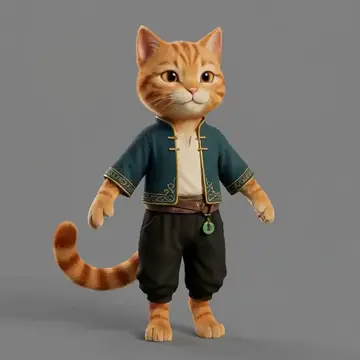<br /><sub><b>MiniMax H3 · 480×480 · 5s</b></sub><br />[▶ Download MP4](docs/animations/cat_jump_minimax_h3_480p.mp4) | <br /><sub><b>MiniMax H3 · 768×768 · 5s</b></sub><br />[▶ Download MP4](docs/animations/cat_jump_minimax_h3_768p.mp4) | 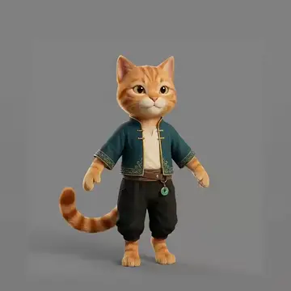<br /><sub><b>Seedance 2.5 · 960×960 · 4s</b></sub><br />[▶ Download MP4](docs/animations/cat_jump_seedance_2.5.mp4) |
| **29 Tokens** ($0.25 cost) | **35 Tokens** ($0.30 cost) | **98 – 220 Tokens** ($0.85 – $1.90) |
| • Ultra cost-efficient<br />• Happy facial expressions<br />• 100% first/last frame loop lock<br />• Rigid accessory stability | • Sharp embroidery & eye gleam<br />• High-bitrate texture fidelity<br />• Just +6 Tokens for HD jump<br />• Smooth knee-flex cushion landing | • Flowing fabric & dynamic cape<br />• Higher aerial apex & hangtime<br />• Cinematic camera drift<br />• Expressive limb movement |

### Model Capabilities Comparison

| Model | Resolution | Duration | Vendor Cost (USD) | 3D Craft Tokens | Key Strengths |
| :--- | :--- | :--- | :--- | :--- | :--- |
| **MiniMax H3 (Hailuo 02)** | `480p` (480×480) | 5 seconds | $0.25 | **29 Tokens** | Unbeatable price-performance, smiling/focused facial cues, rock-solid accessories. |
| **MiniMax H3 (Hailuo 02)** | `768p` (768×768) | 5 seconds | $0.30 | **35 Tokens** | Crisp 768p HD clarity, pristine fur and cloth textures, optimal recommended choice. |
| **ByteDance Seedance 2.5** | `480p` (480×480) | 4s / 6s | $0.85 | **98 Tokens** | Dynamic leaps, exaggerated physics, flowing silk/cape motion. |
| **ByteDance Seedance 2.5** | `720p` (720×720) | 4s / 6s | $1.90 | **220 Tokens** | High-definition fluid simulation with complex spatial movement. |

---

## 🗂️ 3D Models vs. Animations: Clear Library Separation

Creations in 3D Craft are organized cleanly by type in **Your Library** (`StudioViews.swift`):

- **5 Distinct Filters**:
  - **All (全部)**: Aggregated chronological feed of concepts, 3D meshes, and video loops.
  - **Concepts (概念图)**: Source 2D generation sheets and prompt iterations.
  - **3D models (3D 模型)**: Watertight GLB meshes with interactive orbital turntable, lighting rigs, and wireframe views.
  - **Animations (动画)**: Loop-locked character animations playing seamlessly in the full-screen player.
  - **Favorites (收藏)**: Starred models and animations for quick access.
- **Card Badges**: Distinct `cube.fill 3D model` and `film.fill Animation` badges make content recognizable at a glance.
- **Contextual Empty States**: Dedicated welcoming empty states (e.g. *"Bring your characters to life · Generate a looping character animation from your concept"*).

---

## 🎨 Visual Showcase

<p align="center">
  
  
</p>
<p align="center">
  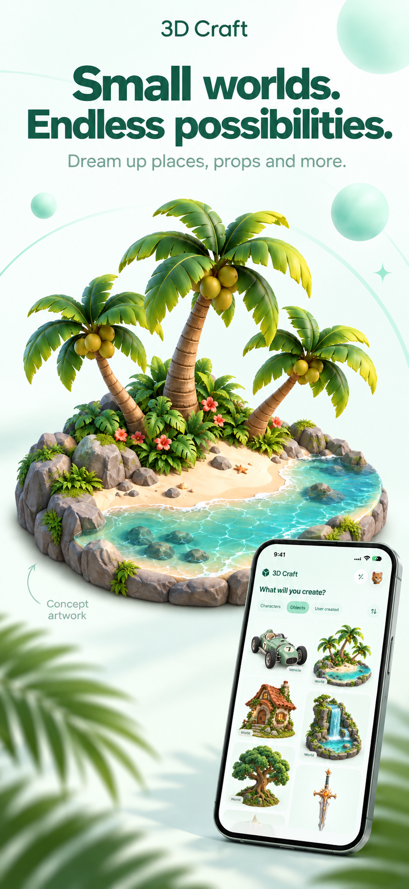
  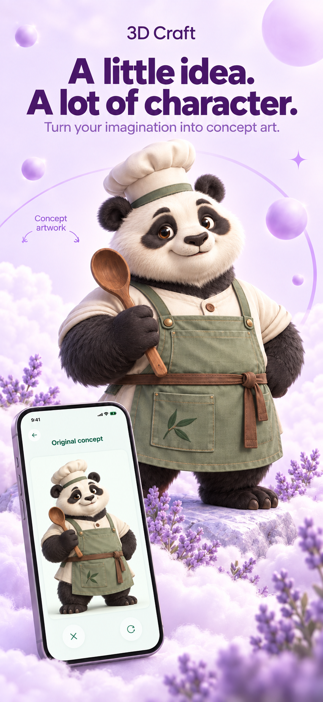
</p>

---

## 📱 Native iOS Experience (iPhone & iPad)

Designed from the ground up for iOS 17+, 3D Craft gives creators a studio-grade environment right in their pocket.

<p align="center">
  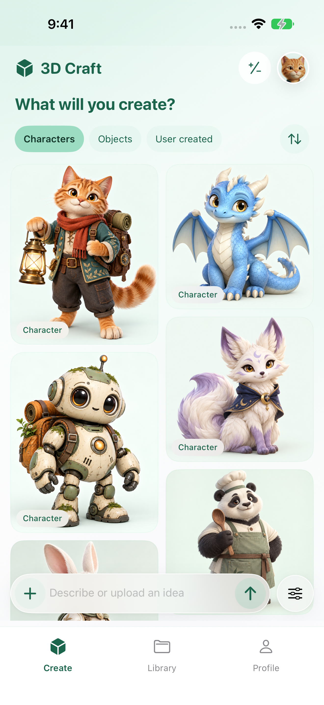
  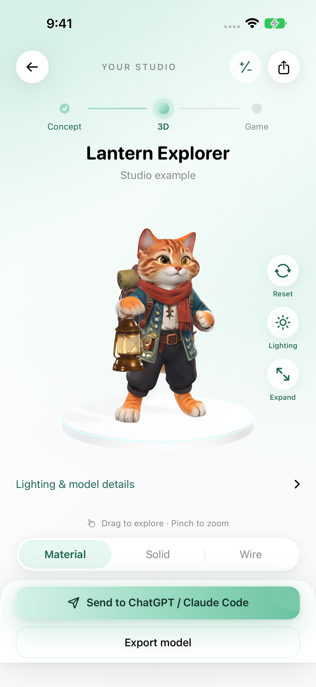
  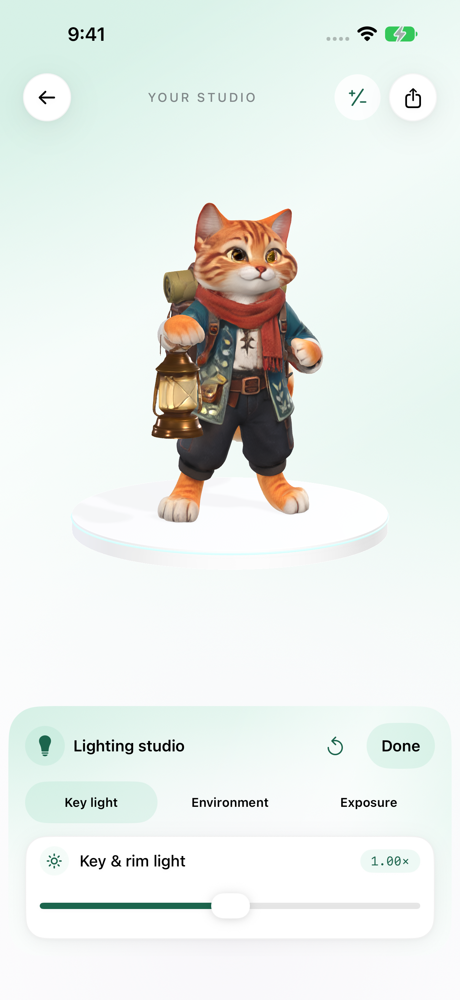
  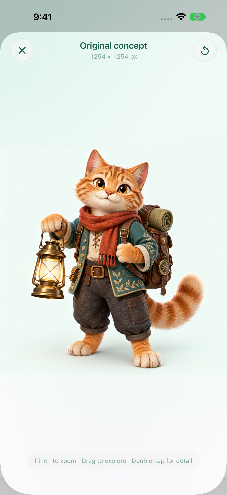
</p>
<p align="center">
  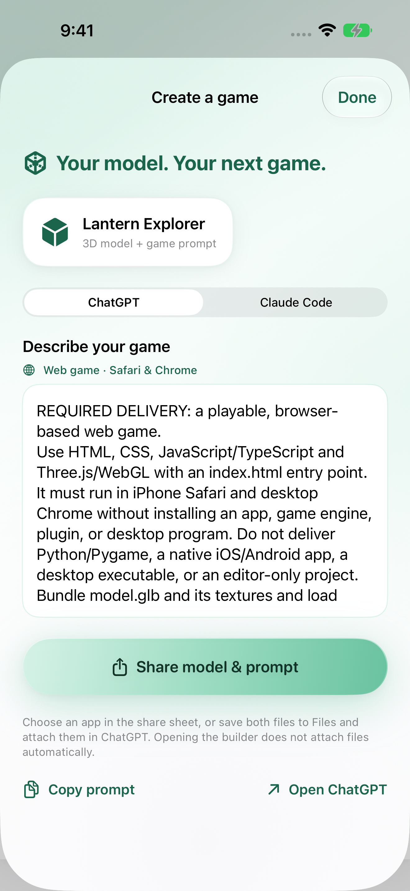
  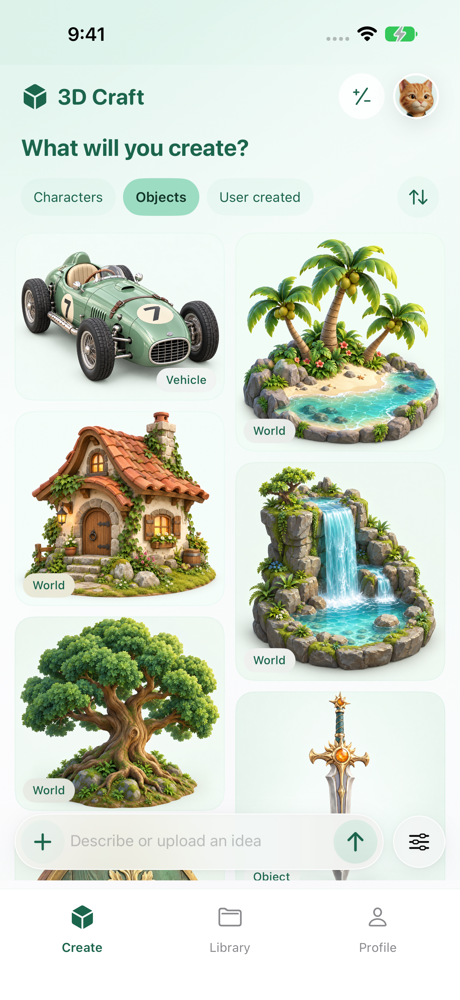
  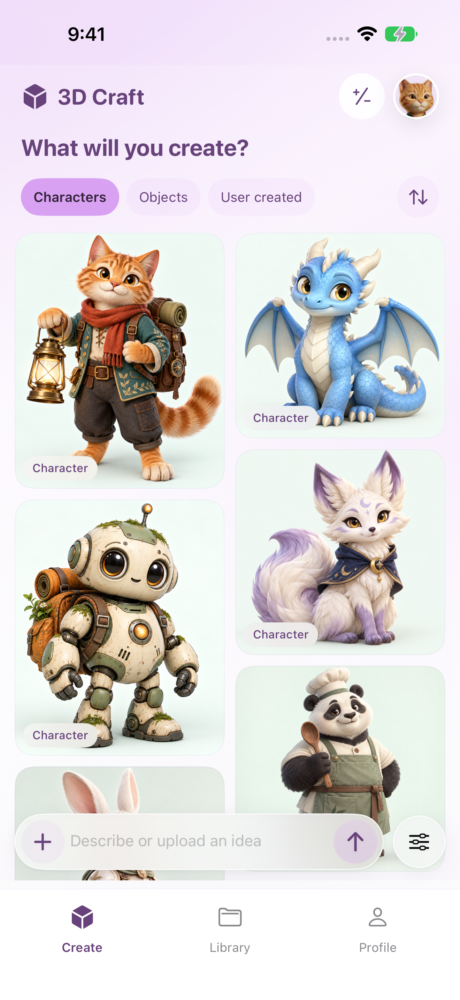
</p>

---

## 💰 Token Economy & Transparent Pricing

3D Craft operates on a transparent token system anchored to real-world cloud GPU compute costs.

### Pricing Anchor: 3D Rodin Base ($0.40 = 46 Tokens)
All token pricing is systematically calculated with a 15% platform margin:

$$\text{Tokens} = \left\lceil \frac{\text{Vendor Cost (USD)} \times (1 + 0.15)}{0.01} \right\rceil = \left\lceil \text{Vendor Cost (USD)} \times 115 \right\rceil$$

| Modality / Task | Underlying Engine | Resolution / Duration | Cost (USD) | Tokens Deducted |
| :--- | :--- | :--- | :--- | :--- |
| **Concept Generation** | Google Gemini 3.5 Flash | 4 Variations | ~$0.08 | **15 Tokens** |
| **3D Model Reconstruction** | Microsoft TRELLIS.2 | Standard GLB + Gaussians | $0.02 | **15 Tokens** |
| **3D Model Reconstruction** | Hyper3D Rodin Gen-2 | Studio Mesh & PBR (Anchor) | **$0.40** | **46 Tokens** |
| **Character Animation** | MiniMax Hailuo 02 | 480P · 5 seconds | **$0.25** | **29 Tokens** |
| **Character Animation** | MiniMax Hailuo 02 | 768P HD · 5 seconds | **$0.30** | **35 Tokens** |
| **Character Animation** | ByteDance Seedance 2.5 | 480P · 4 seconds | $0.85 | **98 Tokens** |
| **Character Animation** | ByteDance Seedance 2.5 | 720P HD · 4 seconds | $1.90 | **220 Tokens** |

---

## 🐲 Themed Mascot Waiting Loops

3D reconstruction can take between 15 and 45 seconds. 3D Craft replaces boring loading spinners with themed, procedural mascot loops:

<p align="center">
  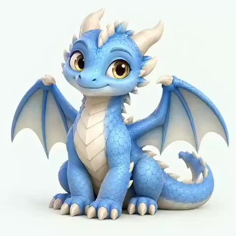
  
</p>

---

## 🎮 Play Your Asset & Game Handoff

Why stop at looking at your 3D models? 3D Craft lets you play with them immediately:
- **Lanternfall**: Bundled 3D action game with boss battles, responsive touch controls, and dynamic night lighting.
- **AI Game Engine Handoff**: Exports clean game design briefs and models formatted specifically for **Claude Code**, **ChatGPT**, or custom game development scripts.

<p align="center">
  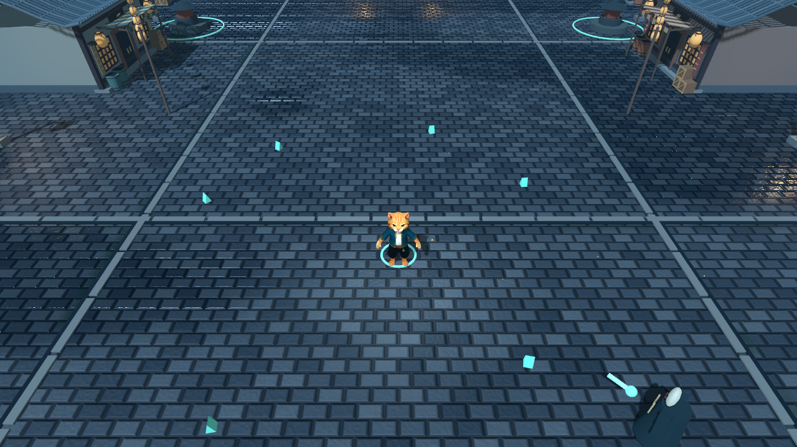
  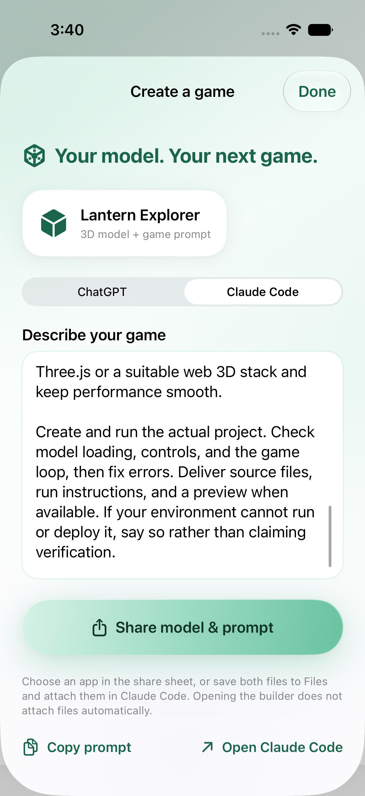
</p>

---

## 🏛️ Built-in 3D Gallery & Inspiration

Browse pre-loaded assets, character concepts, game props, and community creations:

<p align="center">
  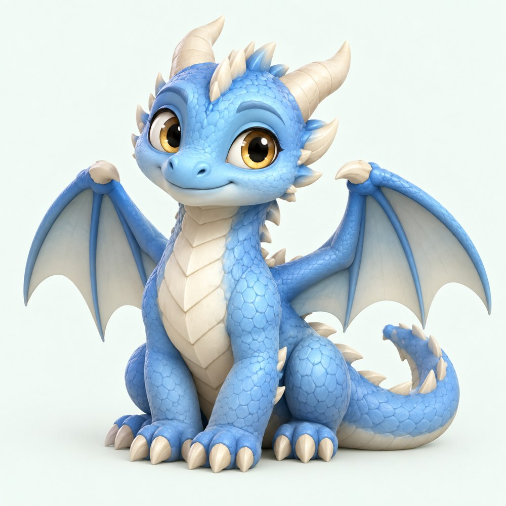
  
  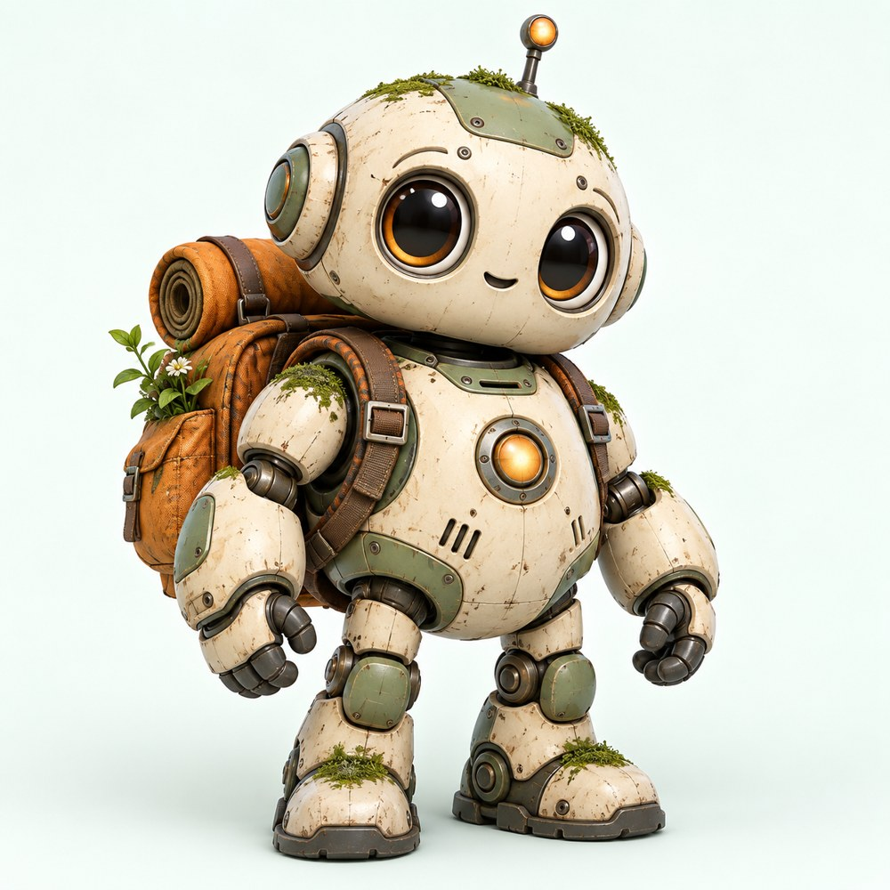
  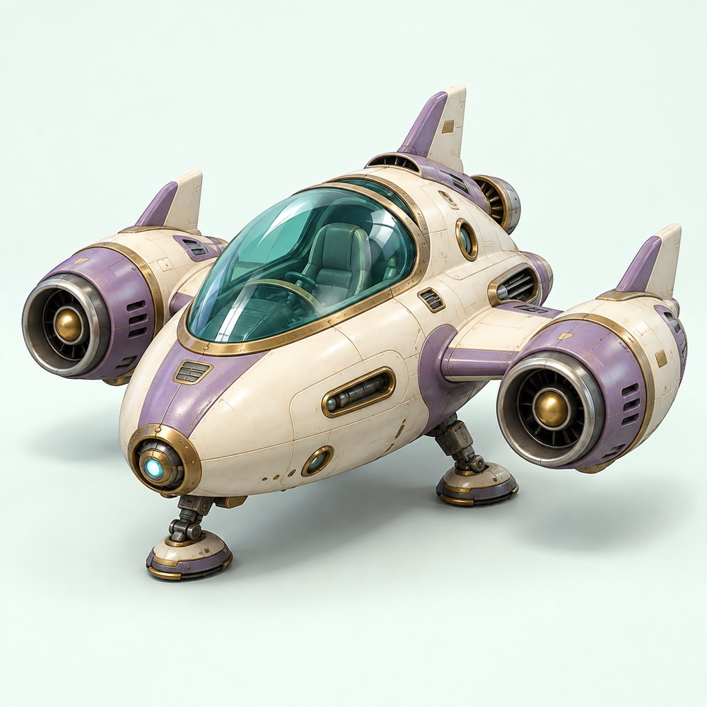
  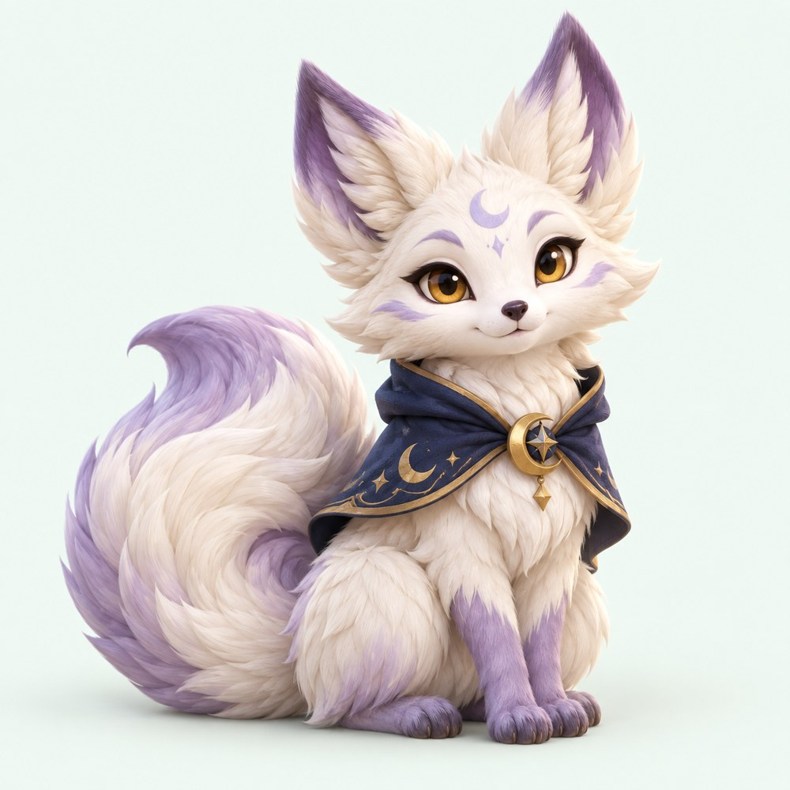
</p>

---

## 🔬 How It Works: The Concept-to-Mesh Pipeline

```
 User Input (Text / Photo / Reference)
                │
                ▼
  [Step 1: Multimodal Prompt Planning]
      Gemini 3.8 Flash / OpenAI Codex
  Analyzes silhouette, symmetry, style & textures (~5s)
                │
                ▼
  [Step 2: Studio Asset Concept Rendering]
      Gemini 3 Pro Image (Imagen 3)
  Produces a background-free, shadow-neutral studio plate (~15s)
                │
                ▼
  [Step 3: 3D Geometry & PBR Reconstruction]
      TRELLIS.2 (Gaussians + Mesh) / Hunyuan3D-2.1 (PBR) / Rodin Gen-2
  Generates watertight topology, normals, roughness & albedo (~30s)
                │
         ┌──────┴──────────────────────────┐
         ▼                                 ▼
  [3D Interactive Studio]         [AI Character Animation]
  • Orbit turntable & lighting    • MiniMax Hailuo 02 (480p/768p)
  • GLB Mesh & PBR inspection     • Seedance 2.5 (480p/720p)
  • Godot mini-games handoff      • Seamless loop video player
```

---

## ⚡ Quickstart

### 1. Web Studio (Frontend Only)
Run the complete web studio in preview mode without needing local GPU weights:
```bash
npm install
npm run dev
```
Open [http://localhost:5173](http://localhost:5173) in your browser.

### 2. Local Inference Server (FastAPI)
To generate real meshes locally on your machine (supports Apple Silicon MPS & NVIDIA CUDA):
```bash
# Set up Python virtual environment and dependencies
./scripts/setup.sh --local

# Download Hunyuan3D shape weights (~7.5 GB)
python scripts/fetch_weights.py

# Launch the FastAPI backend
npm run server
```

Run `npm run doctor` to diagnose GPU hardware, acceleration drivers, and dependencies.

### 3. Native iOS App (Xcode)
```bash
cd ios
xcodegen generate
open CraftStudio.xcodeproj
```
Select your connected iPhone or a simulator target and click **Run**.

To install directly to a connected physical iPhone:
```bash
python3 ios/scripts/install-phone-review.py
```

---

## ☁️ Recommended Cloud Setup: fal.ai & Gemini

For lightning-fast generation without needing a multi-gigabyte local GPU setup:

```bash
export FAL_KEY=your_fal_api_key          # fal.ai/dashboard/keys
export GEMINI_API_KEY=your_gemini_key    # aistudio.google.com/apikey
npm run server
```

The backend automatically switches to cloud mode. Generation runs in seconds and costs pennies per model.

---

## 🔑 Developer API & Agent Integrations

3D Craft exposes a complete REST API for external developers and autonomous AI agents:

### Authenticating with API Keys
Generate account-owned API keys (`craft_live_...`) in the web studio or iOS app under **Profile → API access**.

```bash
# One-step Prompt to 3D Generation:
curl -X POST https://3d-craft.web.app/api/v1/creations \
  -H "Authorization: Bearer craft_live_your_key" \
  -H "Content-Type: application/json" \
  -d '{
    "prompt": "A friendly mechanical frog with brass gears and emerald eyes",
    "engine": "trellis"
  }'
```

```bash
# Generate Character Video Animation:
curl -X POST https://3d-craft.web.app/api/v1/animations \
  -H "Authorization: Bearer craft_live_your_key" \
  -H "Content-Type: application/json" \
  -d '{
    "imageUrl": "https://storage.googleapis.com/.../cat.png",
    "motion": "A joyful jumping dance, bending knees and leaping upward",
    "model": "minimax-h3",
    "resolution": "768p",
    "duration": 5
  }'
```

### Agent Integration Features:
- **Permanent Delete Guard**: Requires an explicit `"Allow permanent deletes"` toggle in Profile before destructive operations are permitted.
- **Repeat-Safe Keys**: Idempotency headers prevent accidental double billing.
- **Live Sync**: Any project created via API appears in your mobile app within ~20 seconds automatically.

---

## ⚖️ 3D Engines Comparison

| Feature | Microsoft TRELLIS.2 | Tencent Hunyuan3D-2.1 | Hyper3D Rodin Gen-2 |
|---|---|---|---|
| **Speed** | ⚡ Fastest (~15s) | ⏱️ Moderate (~45s) | ⏱️ Studio Grade (~60s) |
| **PBR Maps** | Albedo / Vertex color | Real Normal, Roughness, Metallic | PBR texture maps |
| **Apple Silicon (MPS)** | Space / Cloud only | Native MPS supported | Cloud API only |
| **Output Formats** | GLB, 3D Gaussians (PLY) | GLB, OBJ | GLB |
| **Cost (fal.ai)** | **$0.02** / generation | $0.16 (mesh) · $0.48 (textured) | **$0.40** (Pricing Anchor) |

---

## 📂 Repository Structure

```
3d-craft/
├── ios/                      # Native iOS client (SwiftUI, iOS 17+)
│   ├── CraftStudio/          # View architecture, SceneKit viewer, motion tokens
│   │   ├── Sources/          # Swift application source files
│   │   └── Resources/        # Mascots, icons, bundled models, sample videos
│   └── project.yml           # XcodeGen specification
├── src/                      # Web studio frontend (React 18, Vite, Three.js)
│   ├── components/           # Generator card, 3D viewport, workbench
│   └── pages/                # Gallery, Showcase, API Keys manager
├── server/                   # Backend API (Python FastAPI)
│   ├── app.py                # Core routes & job queues
│   ├── api_keys.py           # API key generation, auth, and deletion scopes
│   ├── engines/              # TRELLIS.2, Hunyuan3D-2.1, and Rodin adapters
│   ├── firebase_animations.py# Seedance 2.5 & MiniMax Hailuo 02 animation pipelines
│   ├── pricing.py            # Calibrated token calculation logic ($0.40 Rodin anchor)
│   └── storage/              # Local asset cache and run files
├── docs/                     # Specifications, product guides, and screenshots
│   └── animations/           # High-resolution animation video clips and webp demos
├── games/                    # Godot mini-games and game-ready asset templates
└── scripts/                  # Setup automation, model fetchers, doctor checks
```

---

## 📄 Licenses

- **Microsoft TRELLIS.2**: MIT License.
- **Tencent Hunyuan3D-2.1**: Tencent Hunyuan Non-Commercial License.
- **3D Craft Core & iOS Client**: Proprietary / All Rights Reserved.
