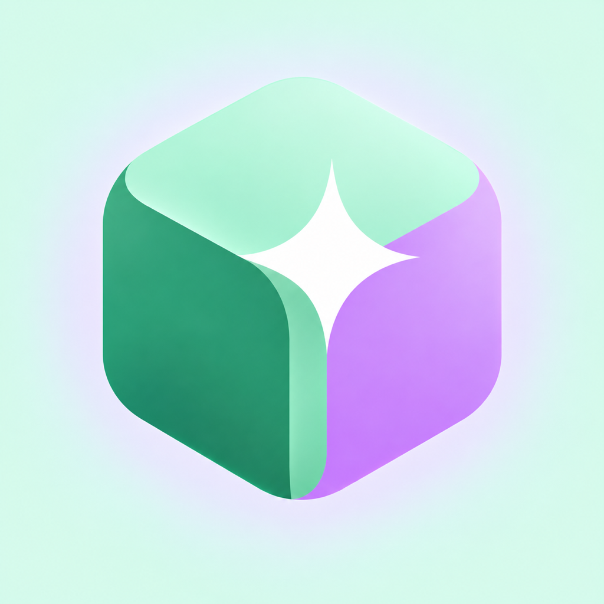
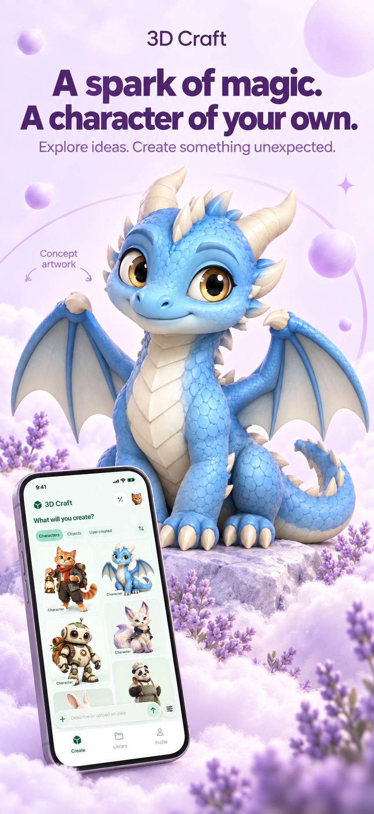
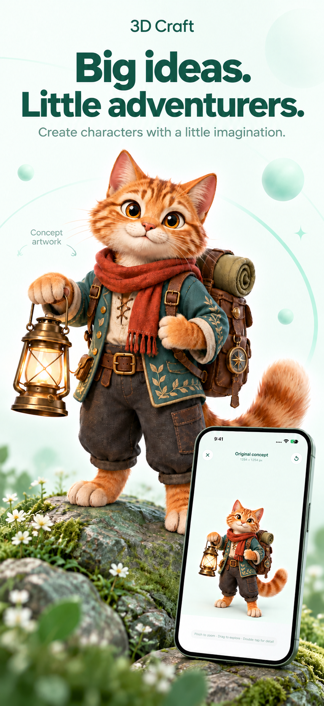

  

<h1 align="center">3D Craft</h1>

Turn an idea or reference image into concept art, a 3D object, and a playable creation.

  <a href="https://3d-craft.web.app">Web studio</a> ·
  <a href="https://toolbox.marketingtools.apple.com/en-us/app-store/us/app/6811466883">App Store listing</a> ·
  <a href="docs/design/image-to-3d-comparison/index.html">Image-to-3D comparison</a> ·
  <a href="docs/design/video-provider-comparison/index.html">Video comparison</a>

  
  

3D Craft has a native SwiftUI iPhone app, a React web studio, and a Firebase-backed creation API. The checked-in iOS project targets iOS 17+ and declares app version **2.5** (build **2026092504**). That is the source version; the App Store listing is the place to check the currently released version.

## Create in the app

1. Describe an idea or add a reference image. The app generates one or more concept images.
2. Select the concept you want. The selected image is carried into a separate 3D confirmation step, where you can inspect the source, choose an engine, and see its Token quote before generating.
3. Open the resulting GLB in the interactive 3D studio. You can also create a character animation, export an asset, or use the game handoff.

Creation and animation are separate actions: selecting a concept does not silently spend Tokens on a 3D model. Work runs as a background job and its status can be revisited from the app.

| Area | Current implementation |
| --- | --- |
| iOS studio | SwiftUI with an interactive SceneKit/GLTFKit2 model viewer, lighting controls, and material/solid/wire views. |
| Concepts | Text or image references, generated concepts, and explicit image selection before 3D generation. |
| Image to 3D | Atlas options including Tripo H3.1, Seed3D, Hunyuan, HI3D, and Meshy; fal options including Rodin, TRELLIS.2, Hunyuan3D, and hybrid. The iOS picker currently suggests Tripo H3.1. |
| Animation | Atlas MiniMax H3, Seedance 2.0 Mini, Seedance 2.0, Seedance 2.5, and Wan 3.0 Prime; fal MiniMax H3 and Seedance 2.5. The iOS picker currently suggests Atlas MiniMax H3. |
| Compare before choosing | The animation model selector is paired with a corresponding Dragon sample video. fal entries do not claim the Atlas sample is a fal result. The 3D confirmation view includes interactive sample meshes for supported models. |
| Themes | Lavender and emerald are independent appearance choices. The lavender gallery uses the blue dragon; the emerald gallery uses the lantern explorer. |
| Games | Built-in browser games, game-building handoff, and community-submitted game links with review, voting, and reporting controls. |
| Accounts and billing | Firebase accounts and cloud library; weekly/monthly Creator subscriptions and separate one-time Token packs through Apple purchases and RevenueCat. |

The [image-to-3D comparison](docs/design/image-to-3d-comparison/index.html) and [video comparison](docs/design/video-provider-comparison/index.html) contain sample outputs and observations. They document particular test runs, not guaranteed results for every prompt or provider.

## Prices and Tokens

The app requests a current quote for the selected model and settings before generation. The confirmation screen shows the required Tokens; Apple provides localized purchase prices for Creator plans and one-time packs. Token costs can differ by model, resolution, duration, and current provider pricing, so this README intentionally does not publish a fixed price table. The weekly and monthly plans renew; Token packs are one-time purchases.

## Architecture

~~~mermaid
flowchart LR
    A["SwiftUI iOS app"] --> C["Firebase Hosting / API"]
    B["React web studio"] --> C
    D["Custom HTTP client with user API key"] --> C
    C --> E["Cloud Run FastAPI"]
    E --> F["Firebase Auth, Firestore, Storage"]
    E --> G["Concept, 3D, and video providers"]
~~~

Firebase Hosting serves the web build and rewrites <code>/api/**</code> to the <code>craft-api</code> Cloud Run service in <code>us-central1</code>. The iOS and web clients point to <code>https://3d-craft.web.app</code>. The cloud API lives in [server/firebase_api.py](server/firebase_api.py); [server/app.py](server/app.py) is the separate local/legacy server.

### Personal API keys

Signed-in users can create scoped, expiring <code>craft_live_</code> keys in the app, view the full key once, and revoke it later. The server stores a hash of the key. API calls use the account's production Token balance; Apple Sandbox Test Tokens cannot be spent through API keys. Keep keys out of repositories and client-side environment variables.

The API works with scripts or clients that support custom HTTP requests, a Bearer key, and the [OpenAPI specification](https://3d-craft.web.app/api/v1/openapi.json). ChatGPT, Claude, Muse, and other chat apps are **not built-in integrations**; whether a particular client can use the API depends on its own custom-tool support.

| Endpoint | Purpose |
| --- | --- |
| <code>GET /api/v1/creations/quote?engine=rodin&amp;effort=high</code> | Get the maximum Token charge for one concept image plus one 3D model. |
| <code>POST /api/v1/creations</code> | Start a prompt-to-concept-to-3D job with an idempotency key and spending cap. |
| <code>GET /api/v1/creations/{id}</code> | Check the creation's stage, progress, and result. |
| <code>GET /api/v1/animations/quote</code> | Get a quote for a chosen animation model and settings. |
| <code>GET /api/keys</code>, <code>POST /api/keys</code> | List or create account-owned API keys. |

For a one-step creation, first request a quote for the same engine and effort. Pass its <code>maxTokens</code> in the POST body; the server rejects a cap below the current quote. For example, after obtaining a quote, a client can send:

~~~json
{
  "idempotencyKey": "my-unique-request-001",
  "prompt": "A friendly blue dragon character",
  "engine": "rodin",
  "effort": "high",
  "maxTokens": 100
}
~~~

The value <code>100</code> above is only an example spending cap, **not** a current quote. Use the returned value from the quote endpoint in a real request. The iOS flow retains its explicit concept-selection and 3D-confirmation steps; this API endpoint is an optional one-step automation workflow.

## Run locally

### Web

~~~bash
npm ci
npm run dev
npm run build
~~~

The web app uses the configured Firebase project and cloud API. Provider secrets must stay on the server; a <code>VITE_</code> variable is bundled into browser JavaScript and is not suitable for private keys.

### iOS

Open [ios/CraftStudio.xcodeproj](ios/CraftStudio.xcodeproj) in Xcode, choose an iPhone simulator or your signed physical device, and build the <code>CraftStudio</code> scheme. Open the checked-in project directly: [ios/project.yml](ios/project.yml) is older than the current Xcode project and should not be regenerated over it without first updating its version/build settings.

### Backend

The deployed API uses [server/firebase_api.py](server/firebase_api.py), [server/requirements.txt](server/requirements.txt), and [deploy/cloud-api/Dockerfile](deploy/cloud-api/Dockerfile). Deployment needs the project's Firebase and Google Cloud credentials plus provider secrets; cloning the repository alone does not grant access to generation services. Local web builds do not deploy or charge for a generation.

## Repository guide

- [ios/CraftStudio/Sources](ios/CraftStudio/Sources): native app, model viewer, model/animation selection, themes, games, billing, and API-key screens.
- [src](src): React web studio and account/API access pages.
- [server](server): FastAPI routes, creation orchestration, pricing, keys, and provider integrations.
- [docs/design/image-to-3d-comparison](docs/design/image-to-3d-comparison): tested 3D model examples and comparison notes.
- [docs/design/video-provider-comparison](docs/design/video-provider-comparison): tested video provider examples and comparison notes.
- [firebase.json](firebase.json), [firestore.rules](firestore.rules), [storage.rules](storage.rules): Hosting/API routing and Firebase rules.

Generated images, models, and videos are user content. Review the displayed quote and source image before submitting a paid generation.
