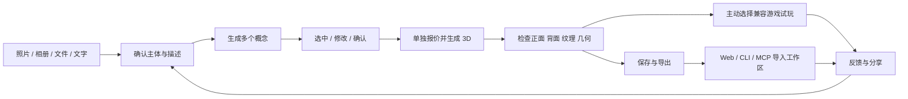
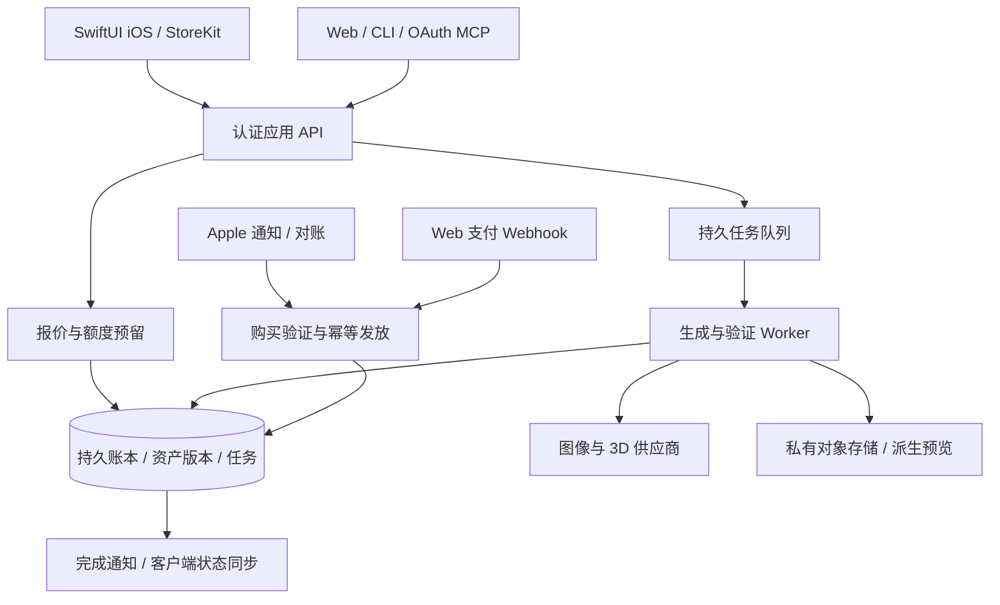
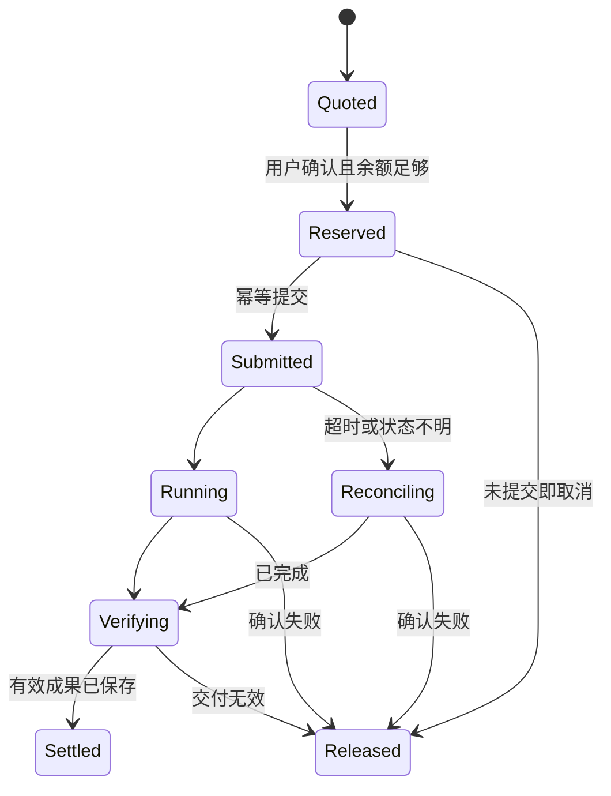

# 3D Craft · iOS 产品与商业实施计划

**从照片与几句话，到属于用户的 3D 资产，再进入游戏与创作工作区。**

版本：v1.0 提案 · 调查日期：2026-09-09 · 初始市场：美国美元定价、英文主界面、简体中文支持 · 客户端：原生 iOS 优先，Android 后续。

本文是可以进入开发排期的产品、商业和技术计划。所有我们的价格、额度、成本准备金、转化率和时间安排均为**建议或模型假设**，没有创建真实收费商品、发生新采购或完成 App 发布。竞品和供应商价格来自本次官方网页调查，未登录结账；以购买时所选版本、地区与合同为准。

配套交付：

- [商业蓝图与定价计算器](3d-craft-business-blueprint-2026-09-09.html)：查看流程、套餐和成本压力测试。
- [定价模型 JSON](pricing-model-2026-09-09.json)、[33 个财务情景 CSV](pricing-scenarios-2026-09-09.csv)、[重算脚本](recalculate_pricing.py)。
- [五家竞品调查](research-2026-09-09/competitor-pricing.md)、[Apple 计费规则调查](research-2026-09-09/apple-billing.md)。
- [九个页面的视觉方案](../design/ios-2026-09-09/README.zh-CN.md)。
- [原商业策略报告](3D_CRAFT_STRATEGY_2026-09-09.zh-CN.md)。本文在客户端方向上采用用户后来明确提出的**原生 iOS 优先**，替代旧报告中“先验证移动网页再决定原生”的阶段建议；质量与商业基础的约束仍保留。

## 1. 建议采用的商业方案

**手机卖易懂的创作套餐，电脑卖按量使用的 Craft Tokens；两端共用资产账户和服务端计量。**

首版建议只突出两个手机商品，避免第一次使用就看到复杂套餐矩阵：

| 商品 | 建议美国价格 | 每次成功付款到账 | 按标准流程可完成的组合 |
| --- | --- | --- | --- |
| Starter Pack，一次性体验包 | **$3.99 / 次** | 100 Tokens | **3 张 2K 概念图 + 1 个标准带纹理 3D 资产** |
| Creator Weekly，主推周订阅 | **$7.99 / 周，自动续订** | 300 Tokens | **9 张 2K 概念图 + 3 个标准带纹理 3D 资产** |

两种商品都提供的是通用额度，上表是其中一种完整兑换组合，不是“只能选概念图或者模型”。用户可以改变比例，实际操作按公开价目表扣除。一次标准流程为三张候选概念、选一张、生成一个模型；不是每张候选都自动生成模型。

**已发放的付费余额不过期。** 周订阅取消后，停止下一次扣款与发放；已购余额、已有资产和基础导出保留。不能把“每周收到新额度”写成“每周把余额清零”。这既是客户体验选择，也避免违背 Apple 对 IAP 购买 credits 不得过期的要求。[Apple 3.1.1](https://developer.apple.com/app-store/review/guidelines/#in-app-purchase)

电脑端建议三档一次性充值：$9.99 / 500 Tokens、$24.99 / 1,300 Tokens、$49.99 / 2,700 Tokens。Web、CLI、MCP 调用同一操作价目表；不额外收“使用 MCP 的手续费”，也不因为跨端打开同一个资产再次收生成费。

**$7.99 / 周是待实验的价格，不是已验证行业标准。** 推荐先以小规模付费 Beta 验证，而非在没有真实成本与留存数据时全面投广告。

## 2. 我们卖什么，服务谁

### 2.1 两类核心用户

| 用户 | 首次价值 | 持续价值 | 主要付费入口 |
| --- | --- | --- | --- |
| 手机创作爱好者：宠物、玩具、手绘与角色爱好者 | 用自己的照片做出有辨识度的角色 | 新装扮、系列角色、收藏与试玩、分享作品 | 一次性包和周订阅 |
| 独立开发者、Game Jam 团队、AI 编程创作者 | 快速拿到能检查、下载的资产 | 版本管理、质量修复、引擎导入、工作区交付 | Web Tokens、CLI/MCP |

移动端带来容易理解的创作入口，电脑端把成果带入真实项目。两类用户共用生成基础，但不把手机用户强行引入技术参数，也不把开发者锁在娱乐式展示里。

第一阶段支持风格化双足角色、简化车辆和少量道具。真实猫照片可以角色化为双足冒险家，但不能承诺任意四足动物都自动拥有自然跑动动画。地标照片可以生成风格化道具，不宣传为测量准确的建筑扫描。

### 2.2 一个闭环，而不是无限加功能

商业闭环对应：真实作品吸引用户 → 免费体验概念 → 在生成模型前清楚报价 → 完成有用资产 → 导出或试玩 → 产生下一次创作需求 → 续订或补充 Tokens。不是靠隐藏续费、清空余额或阻止导出来创造收入。

## 3. 调查结果与定价依据

### 3.1 竞品信号

| 产品 | 本次核查到的公开价格信号 | 对我们的启示 |
| --- | --- | --- |
| Meshy | 免费 100 credits/月，Pro 1,000 credits/月；约 $20/月参考价有官方帮助文档支持，主价格卡与结账仍需复核 | 数量可以宣传，但必须明确每种操作的消耗，不能把竞品 credit 当成我们的 Token |
| Tripo Studio | Pro $20/月、3,000 credits；API 独立计价 | 网页“约模型数”不是供应商 API 采购单价 |
| Hyper3D / Rodin | Creator $30/月；Business $120/月含完整 API | 我们不能按网页订阅模型均价假设可无限商业转售 |
| Polycam | Basic $30/月或 $150/年 | 手机创作存在付费需求，但扫描与生成式角色不是同一成本结构 |
| Customuse | Web Starter $14.99/月，Pro $35/月；App Store 出现 $6.99 等价格但周期未明确 | 不把单个 IAP 金额编写成已证实的周订阅 |

这些是不同产品的公开套餐，未进行同输入同质量对比，也不能直接排名性价比。详情及各项直接来源见[竞品调查](research-2026-09-09/competitor-pricing.md)。

### 3.2 当前工作流相关的上游成本

| 工作 | 官方公开费用 | 本计划如何使用 |
| --- | --- | --- |
| Gemini 3 Pro Image，1K / 2K 输出 | $0.134 / 张图像输出；输入和文本等另外计费 | 标准 2K 概念成本基础 |
| Gemini 3 Pro Image，4K 输出 | $0.24 / 张图像输出；其他输入输出另计 | 高分辨率单独计价 |
| Gemini 3.1 Flash Image | 2K $0.101、4K $0.151 / 图像输出 | 候选优化路线，必须先验证主体一致性与效果 |
| fal TRELLIS 当前旧端点 | $0.02 / 次 | 不将低价端点当作所有质量档的代表 |
| fal Rodin 基础端点及 `/v2` | 页面均显示 $0.40 / 次基础请求 | 预算参考；版本、参数、附加项目须确认 |
| fal Hunyuan v2 | 白模 $0.16，带纹理 $0.48 / 次 | 标准带纹理模型采用更保守的 $0.48 基础预算 |
| Rodin HighPack | 基础价的 3 倍，包含高面数与 4K 纹理 | 高级档预算参考，不默认现有适配器已实现 |
| Tripo H 系列 API | 图生带标准纹理 $0.30；HD 纹理 +$0.10，HD 几何 +$0.20 | 独立候选路线；先质量评测，不为低价直接迁移 |

直接来源：[Gemini 价格](https://ai.google.dev/gemini-api/docs/pricing)、[TRELLIS](https://fal.ai/models/fal-ai/trellis)、[Rodin](https://fal.ai/models/fal-ai/hyper3d/rodin)、[Rodin v2](https://fal.ai/models/fal-ai/hyper3d/rodin/v2)、[Hunyuan](https://fal.ai/models/fal-ai/hunyuan3d/v2)、[Tripo API](https://developers.tripo3d.ai/en/pricing)。均核查于 2026-09-09。基础价不包括我们的重试、后处理、存储、支付和获客。

### 3.3 更高清的产品标准

标准概念目标为原生 2K，精细概念可选原生 4K。使用模型明确支持的分辨率参数，并记录实际输出宽高；不能只把小图放大后标注为原生 4K。[Google 图像生成说明](https://ai.google.dev/gemini-api/docs/image-generation)

手机列表用 320 / 640 px 缩略图，详情按显示大小加载较大预览，用户放大时再取原图。保留生成原图作为 3D 输入，不能误把 CDN 缩略图送去重建。展示图与最终模型纹理分开标记：**4K 概念图 ≠ 4K 纹理模型 ≠ 更准确的几何**。

上一轮三张设计板是 1448 × 1086 的排版展示图，不作为 App 实际 UI 或角色素材直接切图。正式 UI 文字与控件使用原生组件；单屏设计输出以 390 × 844 pt 为基准，3×展示资源约 1170 × 2532 px。角色原图和局部展示资产单独生成，避免把整张九屏拼图拉伸到手机上。

## 4. 统一的 Token 定义与操作价目表

### 4.1 名称与边界

正式名称建议为 **Craft Tokens / 创作点数**。手机主视觉先写“能创作几套”，明细展示 Tokens；电脑直接显示 Token 余额和逐项报价。

Craft Token 是本产品的预付消费单位，不是 Gemini 的语言模型 token，不是供应商 credit，也不是可交易代币。不设现金兑换、用户间转账或投资价值。用户不能按“我输入了几个字”推断价格；耗额来自所选生成工作和质量。

### 4.2 首版与高级功能价目表

| 收费项目 | Tokens | 具体交付 | 上线状态 |
| --- | ---: | --- | --- |
| 生成 1 张标准概念图 | **15** | 1 张目标 2K 图片 | V1 |
| 标准概念图自然语言修改 1 次 | **15** | 1 个新图片版本，旧版本保留 | V1 |
| 一次生成 3 张标准概念图 | **45** | 3 张可分别选择的图片 | V1 |
| 生成 1 个标准 3D 资产 | **55** | 选定输入对应的带纹理模型及 GLB | V1，通过支持类别质量验收 |
| 重新生成标准 3D | **55** | 用户明确发起的新模型版本 | V1；系统失败重试不按此收费 |
| 生成 / 修改 1 张精细 4K 概念图 | **30** | 1 张目标原生 4K 图片 | 通过专项质量与成本验证后启用 |
| 生成 1 个 HD 3D 资产 | **150** | 高级重建与纹理档，具体参数显示在报价中 | 验证后启用，不在首版预售 |
| 补充 3 张一致性视图 | **45** | 同一概念的三个补充方向 | 验证后启用，不能拿三个不同角色概念充当多视图 |
| 重拓扑 | 暂定 50 | 支持范围内的新网格版本 | 后续，不在 App 中显示为可购买 |
| 自动绑定 | 暂定 50 | 仅经过验证的角色体型 | 后续，不属于当前标准模型承诺 |
| 一个动画重定向 | 暂定 20 | 支持骨骼上的一个动画 | 后续，必须已满足绑定条件 |

拍照、选择图片、输入文字、浏览自己的概念、旋转模型、标准 GLB 导出、重复下载已有文件和已有兼容游戏的试玩，**不收生成 Tokens**。若未来某种导出必须调用有费用的转换服务，应在独立确认页报价，不能悄悄对“导出”按钮扣费。基础 GLB 下载保持免费。

多张图片部分成功时按成功保存的图片数扣除。例如提交 45 Tokens，得到两张有效图：最终扣 30，释放 15。存在明确缺陷但文件可下载的结果不能简单算作“系统成功且不处理”；应有质量问题入口与受限审核补偿策略，见第 10 节。

将来调价必须给新报价标明价格版本，不能追溯减少已经售出套餐承诺的兑换权益。旧余额的处理与迁移方案必须在新商品售卖前落实；当前所有测算只适用于此版本价目表。

### 4.3 一个最容易理解的兑换单位

**一套标准创作 = 3 × 15 + 55 = 100 Tokens。**

| 300 Tokens 的用法 | 产出 | 剩余 |
| --- | --- | ---: |
| 默认完整流程 | 9 张 2K 概念图 + 3 个标准 3D 模型 | 0 |
| 只做概念图 | 20 张 2K 概念图 | 0 |
| 已有输入，只做标准模型 | 5 个标准 3D 模型 | 25 |
| 4K 概念探索 | 10 张 4K 概念图 | 0 |
| 已有输入，只做 HD 模型 | 2 个 HD 模型 | 0 |
| 精细完整流程 | 3 张 4K 概念图 + 1 个 HD 模型 | 60 |

这些是**互相替代的使用方式**，不能在付费墙上排成全部同时赠送的权益。所有次数以相应任务和质量为前提；用户主动修改或重做也使用额度。

## 5. 手机端商品设计

### 5.1 V1 只上线两种，后续有明确扩展

| 商品 | 价格 / 周期 | 额度 | 完整标准组合 | 策略 |
| --- | --- | ---: | --- | --- |
| Starter Pack | $3.99，一次性 | 100 | 3 概念 + 1 模型 | 降低首次承诺；同时作为补充包 |
| Creator Weekly | $7.99，每周 | 300 / 次成功付款 | 9 概念 + 3 模型 | 首版主推 |
| Creator Plus Weekly | $9.99，每周 | 400 / 次成功付款 | 12 概念 + 4 模型 | 实验备选，不和首版同时堆在付费墙 |
| Creator Monthly | $24.99，每月 | 1,000 / 次成功付款 | 30 概念 + 10 模型 | 有留存和成本证据后开放 |
| 日体验 | 不做每天自动续订 | 用一次性 Starter Pack 满足临时需求 | 点数不会一天后消失 | 首版不增加“日会员”商品 |
| 年订阅 | 暂不报价上线 | 待验证长期兑换责任 | — | 避免在数据不足时售出长期算力承诺 |

Apple 自动续订周期最短为一周，没有一天自动续订选项。[App Store Connect 周期](https://developer.apple.com/help/app-store-connect/manage-subscriptions/offer-auto-renewable-subscriptions)

周套餐一年按 52 次付款近似为 $415.48，并非“每月 $7.99”。按 52/12 折算平均约 $34.62/月；真实每个自然月可能有四次或五次周扣款，不能用四周固定当一个月。月套餐若开放，需清楚展示每月实际扣款 $24.99 和每月发放 1,000 Tokens，不伪装成周额度。

### 5.2 免费体验与登录

建议完成账户验证后，一次性发放 45 个免费体验 Tokens，只用于最多三张标准概念图；体验点数与付费点数分账，界面说明使用范围。限一次，不采用每天免费重置。预设示例模型可免费查看和试玩。

如果用户先拿到免费的三张概念，再买 $3.99 包：付费 100 Tokens 中只需用 55 来生成第一件标准模型，剩余 45 可继续探索。不要因为“套餐包含三张图”而强迫重新生成或重复计费。

免费三图的模型成本假设为 $0.54 / 新用户；这是获客支出，必须计入免费到付费的转化实验。如果转化率为 10%，仅免费生成就约 $5.40 / 付费用户，可能超过首周贡献。因此先限定 Beta 试用预算与名额，未验证时不大规模免费放量。

### 5.3 续订、取消与余额

首购付款确认后发放本次额度；每次续费交易确认后再发下一笔。关闭自动续订不会撤销已经付款的服务期。取消并到期后，已付余额继续可用，基础账户和已有资产仍可访问。

不设置付费余额上限后把新到账点数截断。长期不使用的用户可以主动收到余额提醒与管理订阅入口；不在余额较多时继续诱导买更多包。

周与月放在同一订阅组，切换时间、差额与生效规则通过实际 StoreKit 商品和交易结果处理。服务端不能根据用户点了“月付”就自行提前补发一整个月额度。

## 6. 电脑端、CLI 与 MCP 的 Pay by Token

| 充值包 | 一次性价格 | Tokens | 默认完整流程组合 | 每套对应的购买金额 |
| --- | ---: | ---: | --- | ---: |
| Token 500 | $9.99 | 500 | 15 张概念 + 5 个标准模型 | 约 $2.00 |
| Token 1300 | $24.99 | 1,300 | 39 张概念 + 13 个标准模型 | 约 $1.92 |
| Token 2700 | $49.99 | 2,700 | 81 张概念 + 27 个标准模型 | 约 $1.85 |

金额是整个组合的平均购买金额，不是供应商成本。Web 折扣幅度受最贵的使用结构约束，不能通过大包卖出负毛利算力。企业大单先单独测算，不自动沿用最大包比例无限折扣。

统一账户中展示总余额，并可查看来源：Web 充值、Apple 订阅发放、Apple 补充包、免费体验、任务退回。不同渠道的价格可不同，操作消耗相同；上线前核实跨平台项目映射与 IAP 要求。iOS 首版提供 IAP，不在全球界面加入“去网站更便宜”的统一按钮。[Apple 多平台服务](https://developer.apple.com/app-store/review/guidelines/#other-purchase-methods)

CLI / MCP 的收费流程：`quote → 用户或已授权预算确认 → reserve → job → settle → download`。读余额、查任务、列资产和重复下载不扣生成费。写操作支持 `max_craft_tokens`、幂等键和报价 ID；批量十个资产的费用必须可预估。默认不自动充值，不允许代理无限重试导致用户余额耗尽。远程 MCP 通过资产 ID 与授权链接工作，不能读取服务端任意路径。

## 7. 单位经济模型：为什么建议 $7.99 对应三套

### 7.1 用于规划的单次成本

下面不是实际账单。它把公开基础价上浮为可测算的变量成本，之后必须用真实任务数据替换。

| 操作 | 预算构成示例 | 变量成本假设 |
| --- | --- | ---: |
| 2K 概念 / 修改 | 图像输出与输入/提示规划合计约 $0.14 × 1.20，另 $0.012 技术处理 | **$0.18** |
| 4K 概念 / 修改 | 输出与其他调用合计约 $0.25 × 1.20，另 $0.02 | **$0.32** |
| 标准带纹理 3D | 基础 $0.48 × 1.20，另 $0.024 处理与传输预算 | **$0.60** |
| HD 3D | 基础 $1.20 × 1.20，另 $0.06 | **$1.50** |

1.20 表示平均尝试次数的规划系数，不是已经观测到“20% 失败率”，也不表示给用户无限人工重做。上述技术预算含有限的处理、存储与传输摊销，是待验证值；长期存储另需容量与成本政策。

每套标准创作：3 × $0.18 + $0.60 = **$1.14**；三套为 **$3.42**。最贵的单 Token 用法是标准概念图：$0.18 / 15 = **$0.012 / Token**。因此 300 Tokens 即使全部用在较贵的图片工作上，变量成本上界也为 **$3.60**，比只测默认组合更保守。

### 7.2 每周 $7.99 的贡献测算

另外按销售额的 5% 预留合计退款、客服及其他变量风险准备金。它是合并预算，不代表真实退款率为 5%；实际会计对退款、平台退费和客服分别处理。

| 项目 | Apple 15% 情景 | Apple 30% 情景 |
| --- | ---: | ---: |
| 用户支付 | $7.9900 | $7.9900 |
| 简化平台费 | $1.1985 | $2.3970 |
| 扣平台费后收入 | $6.7915 | $5.5930 |
| 三套标准创作成本 | $3.4200 | $3.4200 |
| 5% 变量风险准备金 | $0.3995 | $0.3995 |
| 默认组合贡献 | **$2.9720** | **$1.7735** |
| 全额度最贵用法贡献 | **$2.7920** | **$1.5935** |
| 最贵用法贡献 / 扣平台费收入 | **41.11%** | **28.49%** |
| 最贵用法贡献 / 用户销售额 | **34.94%** | **19.94%** |

贡献不是净利润，未扣获客、免费体验、固定云服务、研发工资、税、汇率及其他固定支出。不同利润率分母已分开，不能拿净收入比例当销售额毛利率。

Apple Small Business 15% 需要申请获批，不能因为团队小就自动使用；通常订阅标准合同首年为 30% 平台费，满足累计订阅时间后可能适用 15%，区域合同另算。[Small Business](https://developer.apple.com/app-store/small-business-program/)、[订阅 proceeds](https://developer.apple.com/help/app-store-connect/manage-subscriptions/offer-auto-renewable-subscriptions)

### 7.3 其他套餐与最坏使用组合

完整数值见 CSV，以下均采用所有 Tokens 最终兑换、每 Token 成本上界 $0.012、另留销售额 5% 的模型：

| 套餐 | 支付情景 | 贡献，约 | 结论 |
| --- | --- | ---: | --- |
| iOS $3.99 / 100 | Apple 30% | $1.39 | 适合作为一次性体验与补充包 |
| iOS $7.99 / 300 | Apple 30% | $1.59 | 可以小规模测试，仍需控制获客成本 |
| iOS $9.99 / 400 | Apple 30% | $1.69 | 多送额度并没有大幅增加贡献，先实验 |
| iOS $24.99 / 1,000 | Apple 30% | $4.24 | 约 24.26% 净收入贡献率，留存验证后再上线 |
| Web $9.99 / 500 | 美国境内卡 | $2.90 | 适合个人按量购买 |
| Web $24.99 / 1,300 | 美国境内卡 | $7.12 | 保留约 30% 扣支付费后贡献 |
| Web $49.99 / 2,700 | 美国境内卡 | $13.34 | 不应继续无条件放大折扣 |

Web 示例仅按 Stripe 美国境内卡公开标准价 2.9% + $0.30 / 笔；未加入国际卡、换汇、税工具或可选产品费用。不是所有地区和支付方式的费率。[Stripe 价格](https://stripe.com/pricing)

### 7.4 压力测试与定价红线

若实际变量成本翻倍，周套餐最贵用法成本为 $7.20，在 Apple 30% 下贡献为 **-$2.0065**。因此不能仅凭基础价就承诺未来任何引擎、任意高质量模式都用同样 Tokens。

上线门槛建议：30% Apple 费率、全部额度兑换、保守操作结构下，净收入贡献率至少 20%；常规实测争取 40% 以上。若达不到，先调整新售套餐、工作价格或供应商路线，明确通知并保留既有购买的权益处理方案，不暗中降画质或让余额失效。

已售但未兑换的点数代表未来服务义务。每周记录 `outstanding_paid_tokens × 保守每 Token 成本`，设资金准备金；现金到账不能全部当作已实现利润。收入确认、退款及税务按正式会计政策另行处理。

### 7.5 获客与留存的实际约束

周套餐每次付款贡献若为 $1.59–$2.79，平均总共付款两次（含首购），则总贡献约 $3.19–$5.58，尚未扣免费体验获客支出。没有更强留存前，不支持昂贵的广告买量。

举例：每周留存率固定 70% 时，简化几何模型的期望付费周期为 1/(1−0.70)=3.33，周贡献 $1.59 对应约 $5.31 的生命周期贡献；这是假设演示，不是留存预测。不能对新产品直接用无限期模型报出高 LTV。付费 Beta 应使用实际 30 / 60 / 90 天 cohort。

若固定运营支出假设为 $5,000/月，Apple 30% 情景下每名持续周订阅用户月贡献约 $1.5935 × 52/12 = $6.91，需要约 725 名持续周付用户才覆盖该项支出；还未含获客与研发等未纳入项目。这个例子说明收入规模与利润规模不同，不构成销售预测。

## 8. 全 App 信息架构与用户流程

### 8.1 一级导航

**Create / 创作、Library / 资产库、Profile / 我的**三项。生成中的任务不成为单独的第四个导航；可在创作状态页和资产库任务区找回。

### 8.2 逐屏规格

| 编号 / 页面 | 内容与主要操作 | 后台 / 账户要求 | 费用与关键异常 |
| --- | --- | --- | --- |
| S00 首次启动 | 一句话价值、真实示例、开始创作、语言跟随系统 | 可匿名浏览 | 不出现强制订阅遮挡全部体验 |
| S01 登录 | Apple 登录、已支持的其他登录、条款隐私 | 绑定同一用户 ID | 取消登录保留草稿；重复账户合并另设安全流程 |
| S02 创作首页 | 拍照 / 相册 / 文件 / 纯文字入口，最近作品 | 示例与个人作品区分 | 输入和浏览不扣点数 |
| S03 相机 | 完整主体取景、重拍、使用照片 | 按需请求相机权限 | 拒绝权限可转相册；不要求麦克风或定位 |
| S04 相册 / 文件 | 系统选择器、预览、格式和尺寸检查 | 上传前保存本地草稿 | HEIC、EXIF 方向、超大文件与云相册下载错误可恢复 |
| S05 主体确认 | 裁剪、旋转、单主体确认 | 去除不必要的定位等元数据 | 多只猫或两台车时不静默合并 |
| S06 描述与风格 | 参考图、几句话、少量风格、概念数量 | 生成草稿版本 | 显示“3 张 2K 概念 · 45 Tokens” |
| S07 概念报价 | 数量、分辨率、额度、当前余额、预计扣除后余额 | 服务端短期报价 ID | 余额不足进入套餐页，购买后回到本次报价 |
| S08 概念生成 | 上传、排队、生成、保存阶段 | 持久化任务，可跨设备恢复 | 不知道百分比时不显示假精确进度 |
| S09 概念选择 | 大图、缩略图、全屏检查、保留版本 | 仅更新选中概念版本 | 切换不扣点数、不自动开始 3D |
| S10 概念修改 | 修改描述、发送、版本对比 | 新任务关联父版本 | 2K 修改 15 Tokens；请求重复提交不重复扣费 |
| S11 3D 设置与报价 | 选中概念、标准/已验证高级档、可选补充视图 | 锁定输入版本与价格版本 | 标准 55 Tokens；不存在必需隐藏附加费 |
| S12 3D 生成 | 队列、几何、纹理、验证、文件准备 | 后台 worker 与对象存储 | 下载失败可重取，不立即重跑收费模型 |
| S13 3D 查看 | 转动、缩放、材质/实体/线框、数据、问题反馈 | 读取实际文件与元数据 | 分清完成、加载失败和质量待检查 |
| S14 导出 | GLB、可用转换格式、保存到 Files、系统分享 | 短期授权下载链接 | 原文件重复导出不收 Token；转换失败不丢原件 |
| S15 游戏选择 | 当前模型、兼容游戏、朝向修正、进入 | 按资产类型和已验证运行时路由 | 主动进入；模型失败不可静默改成默认角色 |
| S16 资产库 | 搜索、概念/3D分类、任务、收藏、版本 | 同账户同步与隔离 | 离线展示缓存；云端操作明确不可用 |
| S17 钱包 | 可用/冻结余额、交易来源、任务消耗、补充包 | 服务端不可变账本 | 免费与付费范围分开，退款与任务退回分开 |
| S18 套餐与付费 | 周订阅、一次性包、兑换示例、费用明细 | StoreKit 本地化商品 | 取消、待批准、失败均可回到草稿 |
| S19 订阅管理 | 当前周期、下一次续费、管理、恢复 | Apple 权益与后台同步 | 关闭续费不立即清除已付权益 |
| S20 设置与支持 | 语言、下载缓存、隐私、删除账户、问题反馈 | 可撤销登录和删除请求 | 删除账户提示先管理订阅；不能自动声称已替用户取消 Apple 订阅 |

V1 允许先创建草稿再登录。正式提交云生成前必须有可验证账户、请求预算和服务端额度；免费额度同样不能只依赖客户端判断。

建议初始上传限制：单图不超过 20 MB、一次一个主体，更多参考图在明确的多视图流程中添加；超过限制先在设备上说明并生成适当上传副本，保留用户原文件。限制是产品提案，需按 HEIC 解码、供应商输入和内存实测调整。

作品空间建议先设每账户 10 GB 的透明容量上限，而非承诺无限云盘；订阅取消不删除作品、不降低已有账户的该上限。达到上限时在新任务扣费前提示整理空间，允许下载与删除旧版本后继续用余额。临时上传、未使用的失败中间文件与用户保存的正式资产采用不同保留策略，并在隐私/存储说明中公布。不得把 Token 不过期解释为无限容量或无限下载带宽，也不能悄悄删除已保存作品。

### 8.3 从一次照片到付费模型的完整例子

1. 用户拍自己的橘猫，裁剪到单个主体。
2. 写“变成穿青色夹克的小冒险家”，选择 Stylized，三张概念。
3. 账户首次体验额度允许生成三张；展示本次消耗 45 个体验点数。
4. 看见三张完整独立概念，选择第二张；这一选择不触发重建。
5. 点击“生成标准 3D”，看到 55 Tokens 的报价；付费余额为零，进入套餐页。
6. 用户选择 $3.99 一次性包或 $7.99 周订阅，系统付款成功且后台确认后到账。
7. 返回原报价，余额已变化。仍需明确点击“生成 3D · 55 Tokens”，避免付款完成就偷偷开新任务。
8. 任务完成，用户检查正面、侧面、背面和底部，导出 GLB 或选择 Lanternfall。
9. 手机与电脑资产库同步同一版本；以后通过 MCP 下载无需重新生成或重复收费。

### 8.4 恢复流程

进后台、断网、关闭 App、换设备时，已付任务不丢失。重新登录后读取服务器任务，不从 UI 状态推测是否扣过费。客户端超时不等于供应商失败；标记“正在确认状态”，在拿到确定终态之前禁止自动重发同一生成。

购买 pending 时显示“等待 Apple 确认”，不发放额度；用户取消购买时无任务、无扣点、草稿仍在。API 确认付款晚到时，下一次同步到账，不能要求再买一次。

## 9. App 内收费页面与可直接落地的文案

### 9.1 主付费页内容结构

标题 → 明确总价与周期 → 本次发放 Tokens → 一个真实完整兑换例子 → 操作费用入口 → 主购买按钮 → 一次性替代方案 → 续费与余额规则 → 恢复 / 管理 / 条款 / 隐私 / 支持。

周付文案示例：

> **Creator Weekly**  
> **$7.99 / week**  
> 300 Craft Tokens added after each successful payment.  
> Enough for 9 concept images at 2K **and** 3 standard textured 3D assets using the standard workflow.  
> Spend them your way. Other quality settings and new edits use different amounts.  
> **Subscribe for $7.99 / week**

说明：

> Renews automatically each week until canceled. Unused paid Tokens do not expire. Manage or cancel in Apple Subscriptions. Existing assets and standard GLB downloads remain available after cancellation. No free trial is included in this subscription.

中文对应：

> **每周创作套餐 · 每周 $7.99**  
> 每次成功付款到账 300 创作点数。  
> 按标准流程，可生成 **9 张 2K 概念图，以及 3 个标准带纹理 3D 资产**。  
> 也可自由调整使用比例；高清模式和新的修改任务消耗不同。  
> 每周自动续订，可在 Apple 订阅中管理或取消。已购点数不过期，取消后仍可使用已有余额和导出已有资产。

金额必须来自 `StoreKit Product.displayPrice` 等本地化商品数据；上面是美国美元设计示例，不能作为全球硬编码文案。条款、隐私、恢复与管理入口要可见可用。[Apple 清晰描述订阅](https://developer.apple.com/app-store/subscriptions/#customer-journey)

### 9.2 一次性包

> **Starter Pack · $3.99 once**  
> 100 Craft Tokens. Enough for 3 concept images at 2K and 1 standard textured 3D asset. No subscription. Paid Tokens do not expire.  
> **Buy 100 Tokens — $3.99**

不能将一次性购买按钮写成 Subscribe；不能把免费概念体验写成“订阅免费试用”，因为首版没有 StoreKit 免费试用。

### 9.3 生成确认

| 场景 | 英文示例 | 中文示例 |
| --- | --- | --- |
| 概念报价 | 3 concepts · 2K · 45 Tokens | 3 张概念图 · 2K · 45 点数 |
| 3D 报价 | Standard textured 3D · 55 Tokens | 标准带纹理 3D · 55 点数 |
| 余额 | Available: 300 · After generation: 245 | 可用 300 · 生成后剩余 245 |
| 额度不足 | You need 20 more Tokens. Your draft is saved. | 还差 20 点数，草稿已保存 |
| 系统失败 | Generation failed. 55 Tokens have been returned. | 生成失败，55 点数已退回 |
| 终态不明 | We’re checking this task. You won’t be charged twice. | 正在确认任务状态，不会重复扣费 |
| 恢复 | Your balance has been synced. | 余额已同步 |
| 取消续订 | Your plan stays active until {date}. Paid Tokens remain available. | 套餐有效至 {date}，已购点数继续保留 |

“已退回”只能在账本释放或冲正成功后显示。UI 点击按钮不代表交易完成。

### 9.4 钱包可解释性

钱包同时展示可用余额与任务冻结数，不把冻结额算成已花掉的钱。每笔记录能展开：任务、输入版本、分辨率、消耗、时间、账单来源、失败退回。免费 Tokens 的限定用途必须在余额旁说明。账单详情不暴露供应商凭据。

## 10. 质量、重试与补偿政策

### 10.1 每个付费输出的最低交付检查

概念：有文件、能解码、尺寸与报价一致、主体不截断、单主体、无明显无关替换。模型：文件可下载可解析、非空几何、没有 NaN/无限尺寸、纹理引用完整、能生成多角度预览。角色和车辆还要专项检查融合、重肢、错误正面、严重穿模等常见问题。

自动检查通过只表示达到技术门槛，不能宣称审美或动画质量必然合格。记录质量评分、用户选择、问题类型与修复结果，用真实样本决定支持范围。

### 10.2 谁为重做付费

| 原因 | 用户 Tokens | 系统行为 |
| --- | --- | --- |
| 供应商失败、空文件、缺纹理、可验证交付错误 | 不扣或自动退回该阶段 | 有限次数内部重试，成本归平台 |
| 下载暂时失败但供应商已完成 | 不新增扣费 | 重取文件，不重建模型 |
| 用户主动换衣服、换造型、换概念 | 新报价后收费 | 新版本保留旧输出 |
| 明显融合、偏嘴、缺失主体等质量问题 | 先标记待评估；成立后退点或一次替换 | 限同一任务的补偿流程，防止无限重复退款 |
| 用户单纯不喜欢风格但任务符合选择 | 不自动无限免费重做 | 提供修改建议和明确新费用；善意补偿另记预算 |

现金退款由支付渠道与适用规则处理；任务失败退 Tokens 与 Apple 现金退款是两套不同流程。收到现金退款后按对应交易冲正余额，不扣其他订单的点数或删除不相关作品。

### 10.3 多视图与高清不能只当加价按钮

生成三个不同设计的 concepts 是“探索选择”；同一设计的前、侧、后视图是“重建输入”。数据结构和界面必须区分。生成侧面和背面时锁定同一身份、衣服、配色、比例、照明与正交方向。视图不一致时不盲目送去融合重建。

先做约 30 个代表输入的质量与成本基线，覆盖猫角色、白机器人、单车、龙与简化道具；对单图、补充视图和高级纹理进行可对比实验，记录有效交付率及每个合格资产总成本。若高级模式没有持续收益，宁可不卖，不用“HD”掩盖偶然更好看的结果。

## 11. 原生 iOS 与后端架构

### 11.1 客户端选择

采用 **Swift + SwiftUI** 作为 iOS 主应用；相机、系统相册、Files、分享、登录与支付使用原生能力。网页已有的 React 代码用于 Web，不要求通过 React Native 复用视图层。

3D 预览先做两到三天技术验证：RealityKit 路线与现有 GLB 渲染/转换链路对比，确认格式、材质、内存和透明贴图正确。RealityKit 加载格式与可用系统版本须按实际 API 文档和真机验证，不能默认现有 GLB 会零改动直接加载。[Apple RealityKit](https://developer.apple.com/documentation/realitykit)

资产原件保留 GLB；iOS 可生成经过验证的预览派生文件。原生预览不能完成的短期能力可通过边界明确的 Web 内容处理，但主创作、账户和支付不是整站套壳。现有游戏先验证移动触控和运行时兼容性，避免把移植所有五款游戏变成首发阻塞。

Android 后续共享 API、资产模型、价格版本与账本；UI 可用 Kotlin / Compose 独立实现。此次不同时开发两套客户端。

### 11.2 服务端拓扑

不直接从手机调用供应商。私有上传、资产读取、删除和生成接口均验证账户；下载使用短期链接。供应商密钥只在服务端，客户端不可信任自己的余额、商品价格或生成成功状态。

### 11.3 必须新增或加强的数据实体

| 实体 | 最少字段与作用 |
| --- | --- |
| User | 内部 ID、认证关联、地区/语言偏好、删除状态 |
| Project / Source | 所有者、照片元数据、私有存储键、草稿、主体选择 |
| ConceptVersion | 父版本、提示词、实际宽高、模型/参数、选中状态 |
| AssetVersion | 所有者、conceptVersionId、GLB、纹理、预览、质量检查、大小 |
| Quote | 价格版本、操作、输入哈希、质量、最大 Tokens、有效期 |
| Job | 所有者、幂等键、报价、阶段、供应商请求 ID、终态、实际成本 |
| LedgerEntry | 来源交易、授予/冻结/消费/释放/冲正、数量、关联任务 |
| Subscription | 商店原始交易、产品、当前状态、到期、续费状态 |
| ProviderCost | 端点、参数、请求次数、账单、估算/实计区分 |

数据库可以延续现有 Firebase 生态，但不能用普通客户端文档写入代替交易账本。高并发扣减必须采用事务和服务端权限。收入分析与 Token 流水分开，避免混淆美元和点数。

### 11.4 任务 API 契约

建议接口：`POST /quotes`、`POST /jobs`、`GET /jobs/{id}`、`POST /projects/{id}/selection`、`GET /wallet`、`GET /wallet/entries`、`POST /billing/apple/transactions`、支付通知入口、资产导出入口。

`selection` 只选择版本，不能提交生成。`jobs` 必须引用有效报价和幂等键；失败后可恢复原任务或新报价。报价有效期内价格锁定，实际扣除不超过用户确认值。内部更昂贵的自动回退由平台承担，或者停止并向用户重新报价，不能暗中多扣。

### 11.5 账本与交易状态机

同一报价重复点十次只生成一次，重复 Webhook 不加钱，重复成功回调不扣两次。用户手机超时不触发新的供应商任务。账本修改保留追加式记录，不覆盖历史来隐藏错误。

### 11.6 Apple 支付落实

StoreKit 2 交易验证、`appAccountToken` 等账户关联、App Store Server Notifications V2、服务端定期对账。处理初购、续费、pending、关闭续订、到期、退款和退款撤销。订阅管理、恢复与换机余额同步是不同动作，不能通过恢复购买重新发放已花掉的 Tokens。[Apple 购买与恢复](https://developer.apple.com/documentation/storekit/offering-completing-and-restoring-in-app-purchases)、[通知类型](https://developer.apple.com/documentation/appstoreservernotifications/notificationtype)

退款到来时若该笔 Tokens 已花完，记录对应退款缺口并按公示政策处理；不能任意让其他正常付费记录为它买单。防滥用措施与现金退款权利分开，不设置无法联系客服或无法取消的障碍。

## 12. 当前代码与商业计划之间的真实差距

本次读到的是当前 `master` 工作区，包含大量既有未提交修改；没有为了写计划改变产品代码。

| 当前证据 | 对商业版的影响 | 必须做的工作 |
| --- | --- | --- |
| `server/pipelines.py` 的 `_drive` 在概念阶段后继续 `_stage_model`；`select_concept` 也调度模型任务 | 与“先选概念、再单独确认收费”冲突 | 拆开两个付费阶段，创建明确的等待确认状态 |
| `src/store/StudioContext.tsx` 余额初始化为 120；当前商业文档也标明 cosmetic credits | 不能作为真实充值或扣减来源 | 服务端钱包、事务、对账和全客户端只读余额 |
| `server/gemini.py` 的图片请求当前只设置 aspectRatio，未显式设置输出 imageSize | 不能宣传已经稳定交付 2K / 4K | 加入版本支持校验、分辨率参数、输出尺寸验证与成本记录 |
| `server/config.py` 的展示引擎名与实际端点名称不完全一致 | 不能由 UI 标签推定采购版本和质量 | 报价和成本按实际 endpoint + 参数 + 版本记录 |
| 商业基础文档列明 API 身份/所有权、持久任务仍有缺口 | 不具备公开多租户收费前提 | 用户隔离、私有存储、持久队列、安全支付入口 |
| 游戏已有按类型选模型的规则 | 可作为移动端试玩基础 | 验证实际移动设备、触摸输入与模型加载，不能承诺自动 rig |

必须先补这些基础再收费。设计里“项目已保存”“失败返还点数”等句子，都对应可验收的后台能力，不能只把文案先上线。

## 13. 开发阶段与验收门槛

以下按一名 iOS 工程师、一名后端工程师及部分设计/QA 支持估算约 **8–10 周**；是工作量预算，不是承诺日期。个人实施或供应商集成受阻需要顺延。每阶段按验收结束，不按日历强行推进。

| 阶段 | 时间预算 | 交付 | 验收 |
| --- | --- | --- | --- |
| P0 技术与质量基线 | 第 1 周 | 原生项目、相机/图片处理 spike、3D 格式验证、30 输入评测计划、真实报价清单 | 至少两档真机可正确显示同一模型；确认适合售卖的输入类型与成本 |
| P1 账户与可靠任务 | 第 2–3 周 | 账户、私有上传、草稿、持久任务、概念/模型拆分、钱包基础 | 两用户不能访问彼此资产；重启和重复提交不丢任务、不双扣 |
| P2 创作主流程 | 第 3–5 周 | 九屏方向对应的原生主流程、2K概念、版本选择、独立3D确认、查看与导出 | 从真实照片走到可下载模型；前后台切换与断网恢复通过 |
| P3 付费与透明用量 | 第 5–6 周 | 两个IAP商品、Web充值、服务端验证、付费墙、余额流水 | Sandbox/TestFlight 初购续费退款恢复等场景全部通过；未配置真实商品前不宣称已售 |
| P4 资产体验与试玩 | 第 6–7 周 | 跨端资产库、至少一个经验证的角色试玩、朝向修正、语言和支持 | 使用用户模型；错误可恢复；英文/中文、动态字号可用 |
| P5 受控付费 Beta | 第 8–10 周 | 质量回访、供应商成本对账、低额付费测试、审核材料、发布候选 | 成本和成功率达标，再决定正式发布及是否增加月付 |

原生 App 开发可以从 P0 开始，支付商品创建及正式发布仍是后续明确操作；本次文档交付没有开始扣费或发布。

### 13.1 产品验收清单

- 输入：真机拍照、相册云端图片、HEIC方向、文件错误、多主体、键盘遮挡、权限拒绝。
- 创作：三图部分失败、切换概念不生成、版本不会串线、4K只在确实支持时出现。
- 模型：文件完整、材料正确、能看到背面和底部、设备不支持时给合理降级。
- 付款：用户取消、pending、成功晚到、重复通知、续费失败、恢复购买、换机、退款、退款撤销。
- 钱包：跨 Web/iOS 并发扣款、额度冻结、退款来源、取消订阅后余额可用。
- 游戏：实际加载指定模型、朝向、移动、退出返回原模型、弱网错误；不静默用默认角色替换。
- 隐私：只请求必需权限、删除账户、原图定位信息处理、客户文件访问隔离。
- 可访问性：VoiceOver、动态字号、对比度、减少动态效果；所有文案英中切换。

## 14. 商业验证与运营

### 14.1 指标定义

北极星指标建议为 **每周被用户实际使用的合格资产数**：生成后明确接受并完成一次导出或成功进入兼容游戏；同资产版本去重。不能只用提交的任务数或漂亮的首页曝光来衡量价值。

漏斗：安装 → 选图 → 概念成功 → 选择概念 → 看报价 → 付款 → 模型成功 → 用户接受 → 导出/试玩 → 第二次创作 → 下一周期续费。

每个阶段记录耗时、放弃率、失败原因、平均与 P95 成本。不要为埋点上传原始照片或完整提示词到第三方分析服务；分析使用 ID、枚举和必要的匿名化属性。

### 14.2 首次 Beta 的可执行规模

建议先招募 30–50 名目标用户，覆盖手机宠物创作与独立开发者。免费体验额度和研究补偿使用单独预算；生成试验与正式套餐销售的财务记录分开。先验证一件真实作品能完成，再扩大到约 200 名受控测试用户。

建议目标而非当前实绩：技术交付成功率 ≥95%；支持类别的人工合格率 ≥80%；双重扣费为 0；确定系统失败的额度释放在 5 分钟内完成；终态不明确的任务提供持续状态并进入 24 小时人工对账队列。

合格率若不足，不通过只减少模型数量补救，应先限制不稳定类型或修复流程。

### 14.3 定价实验方法

先比较 $7.99 和 $8.99、同样 300 Tokens；不要同时更换价格、额度、免费试用和图片质量，否则无法判断原因。用新的用户 cohort，既有用户权益按政策保留。观察净贡献/曝光用户、退款、取消与第二次创作，而不是只比较第一次付款率。

之后才测试 $9.99 / 400 Tokens 的更高产出包。$24.99 月付在用户有持续需求后推出，同一订阅组清晰切换。小样本只能得方向性结果；先做访谈，不把几十个用户的差异宣传为统计结论。

### 14.4 获客顺序

第一阶段使用真实照片→概念→模型→试玩的短演示、独立开发者案例与 Game Jam 合作；每个案例说明实际导出格式和支持范围。第二阶段发展 CLI/MCP 工作流教程，让用户把资产导入自己的项目。第三阶段才测试付费广告和更大规模消费市场。

分享默认用户主动选择，私人资产不自动公开。暂不建设公开作品社区，减少首版审核、内容治理和社交功能成本。后续若上线公开内容，再增加举报、屏蔽和审核流程。

### 14.5 前 90 天的预算方法

开发预算按人周报价，不把本计划里的单次算力价格当成项目总成本。示例预算为 iOS 8 人周、后端 8 人周、设计与 QA 合计 6 人周，共 22 人周；若内部核算每人周 $1,500–$4,000，则劳动成本约 $33,000–$88,000。这个区间纯属预算情景，不是市场薪资调查或外包报价；创始人自己开发也应记录机会成本。

生成实验按输入数、路线数与重试预算单列，例如 30 个输入 × 3 条路线 × 每套 $1.14 = $102.60，仅用于标准流程预算示例，HD 路线另算。受控 200 人免费三图实验另预留约 $108。固定服务、域名、开发者账户、客服、税务与法律支持按实际账单列项，不用假定包进 $0.60 的每模型成本。

在实际账单、技术成功率和付费 cohort 能对上之前，把资金优先花在质量、可靠计费及真实用户访谈上。预算上限、任务并发上限和供应商日消耗告警同时设置，避免一次公开流量峰值消耗全部余额。

## 15. 决策记录与上线前未决项

### 已有明确方向

原生 iOS 优先；保留网站风格；英文为主并支持中文；照片/图像与文字先生成概念；用户确认后才生成模型；手机用可理解的套餐；电脑 Pay by Token；用户主动试玩自己的资产。

### 本计划推荐、等待实测校准

$3.99 / 100 的一次性包，$7.99 / 300 的周订阅；2K 概念 15、标准模型 55；付费点数长期保留；免费体验一次三张概念；首版不卖未验证的绑定、动画和高级纹理模式。

### 开发开始时需要落实的事项

1. 品牌最终名称及 App Store 开发者主体；当前设计使用 3D Craft 作为工作名。
2. 美国优先的发布范围、Apple Small Business 资格及实际付款合同。
3. 所选生成供应商的商用/转售/数据处理条款与实际版本价目表。
4. 原生预览格式、最低系统和支持设备，经真机基线确定。
5. 持久钱包与任务基础完成后，再配置真实 IAP / Web 商品。
6. 隐私政策、条款、支持方式、退款规则、存储政策和安全审核说明。
7. 多端 Tokens 的 IAP 商品映射与审核说明；不把某一地区的外链支付许可全球化。

这些事项不会阻止开始本地 P0 技术验证，但会阻止未验收即公开收费。

## 16. 执行结论

首版承诺应当简单且可兑现：**$7.99 每周到账 300 Tokens，按标准流程可生成 9 张 2K 概念图和 3 个标准带纹理 3D 资产；点数自由分配、付费余额不过期，已有资产可继续导出。**

把质量验证、分阶段确认、可恢复任务和透明扣费作为产品的一部分。用户愿意续订的理由应该是下一件作品值得做、做出来确实能用，而不是不清楚自己为何又被收费。
