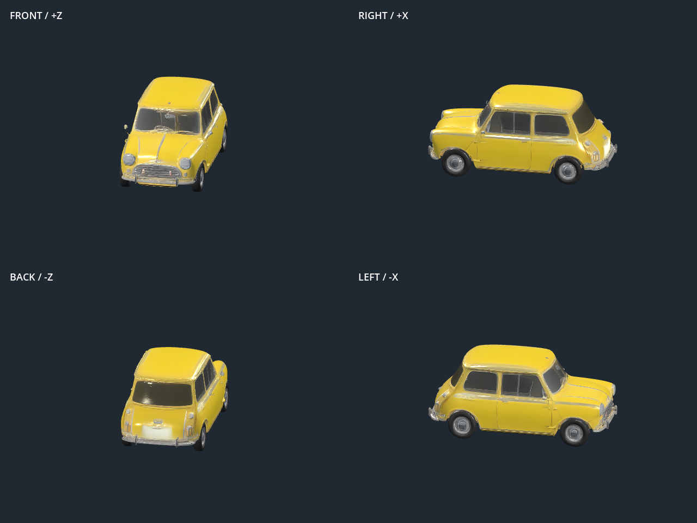
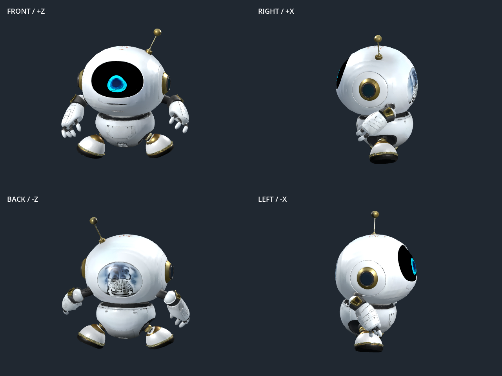

# Reviewed Explore model replacements — 9 September 2026

Both promoted files are also the source for the Godot game assets. The original reference images remain unchanged. The game build records their hashes in `games/forma-playground/assets/manifest.json`.

| Asset | Selected reconstruction | Review |
| --- | --- | --- |
| Yellow mini | Rodin, single original image, high effort, seed 19 | One coherent car, distinct front and rear, four wheels; replaces the fused double-body model. 100,621 faces, 2K texture. |
| White robot | Actual `fal-ai/trellis-2`, single original image, seed 23, 1536 geometry resolution, 18 steps per stage, 4K texture, remesh | One front face and one antenna, improved mouth alignment. 148,403 faces. Minor surface and rear service-cover texture noise remains. |

The first robot retry used Rodin and produced a second face and a second antenna on the back. It was rejected after the four-view render. A local material patch of the TRELLIS.2 candidate introduced visible seams and was also rejected. The promoted robot is the better unpatched TRELLIS.2 result; it is not represented as flawless.

Original files, generation requests, candidate results and native review renderer are preserved under `server/storage/game-asset-rebuild-20260909/`. Yellow car job: `job-dfa6f2389b`; rejected Rodin robot job: `job-49ceb5ed87`. The selected robot's full endpoint parameters and provider result are in `robot-trellis2/` under that directory.

## Repeatable review sequence

1. Use the original canonical image first. Do not synthesize more views merely to increase their count.
2. Compare a second reconstruction engine when geometry duplicates or the inferred rear is implausible.
3. Render front, rear, left and right under the same light, camera and scale. Check body count, face count, wheel count, antenna count, silhouette and texture boundaries.
4. Preserve failed candidates and record why they were rejected. Promote only the reviewed candidate to `public/models`, refresh its gallery URL and report actual geometry statistics.
5. Rebuild and test every game using the replacement. Orientation and dimensions can change between reconstructions even when the filename stays the same.

These decisions do not change the default generation provider for unrelated user assets. Multi-view consistency validation remains in the existing reconstruction pipeline. Godot limits its imported game textures to 2K; the source Explore GLB retains its original resolution.
